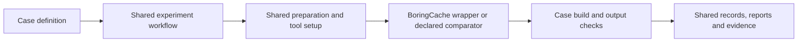

# BoringCache benchmarks

This repository runs benchmarks and reports their measurements: build and cache
times, storage bytes, cache hits, output checks, failures, and source/run links.
It uses one case format, shared execution workflows, and shared reporting.
Performance explanations and recommendations belong in a separate review.

Workloads live in [`cases/`](cases/). Each case pins its upstream source and declares
its recipe, comparison, cache scope, and output verification. Exploratory technical
work is an **evaluation**. Promotion changes metadata and suite membership; it does
not change the case's identity or copy its executor.

Follow [`docs/process.md`](docs/process.md) to add or run a case.
[`Tool coverage`](docs/tool-coverage.md) lists configured families and qualification gaps.
[`AGENTS.md`](AGENTS.md) applies the same requirements to agents and humans.
The [cadence monitor](docs/cadence.md) records current central runs in
[`data/latest/current.json`](data/latest/current.json) and retains observations
under [`data/observations/`](data/observations/). All active workers default to the
exact published canary in [`config/cli.json`](config/cli.json).

`bin/bench catalog` generates [`data/latest/series.json`](data/latest/series.json),
the common index for planned, requested, incomplete, failed, and completed
evaluations. It uses the canonical report validator and calculations, retains
evidence gaps, and leaves publication review explicit.

Standard comparisons use two shared fresh and rolling workflows, which also
support `workflow_call`. All cases use one [BoringCache wrapper](.github/actions/boringcache/action.yml)
for the product invocation and release pin. Preparation and common tool setup
use shared actions; case payloads keep their upstream recipe and output checks.
Docker cases also share [provider setup, timing, and publication policy](.github/actions/docker-benchmark/action.yml).
`bin/bench collect` imports preserved phase artifacts and generates a report after
checking the dispatch and completed jobs. Original product evidence is retained
after product cleanup.

Each fresh sample runs independently with its own cache scope. Providers start
in parallel; the sample's warm builds follow its cold builds on fresh runners.
Other samples and cases do not wait for it. Native rolling comparisons keep a
queue for the case and series whose cache they advance; the Cargo chains also keep
their seed ordering. GitHub runner availability can still cause waiting, and
the repository's Actions Cache quota is shared.



```sh
bundle install
bin/bench list
bin/bench check
bin/bench plan hugo-go --lane fresh
bin/bench prepare hugo-go --native-lane fresh --directory /tmp/hugo-benchmark
bin/bench start hugo-go --series screening-01 --lane fresh --samples 2
```

All BoringCache plans use `boringcache/benchmarks`. Case tags and series identities
control reuse within that workspace. GitHub Actions uses OIDC; connection to the
existing workspace must be verified before cutover.

Compare the declared build and cache reuse operation. Record storage with its
provider and measurement source. Queue delay, unrelated dependency setup, and job
duration are recorded separately from the measured operation. Keep cold,
identical-source warm, and changed-source results separate. Collect the declared
samples and report medians and ranges without discarding slow observations.

The [product benchmark page](https://boringcache.com/benchmarks) uses separately reviewed results.
The current measurement feed is [`data/latest/current.json`](data/latest/current.json).
The discarded experimental batch has been removed. The new baseline is defined in
[`config/baseline.json`](config/baseline.json); scheduling stays paused while caches
are reset and the rolling seeds are verified. Earlier run receipts cannot enter
this baseline.

Consolidation is in progress. [`docs/migration.md`](docs/migration.md) lists its
acceptance conditions. Old repositories remain until their execution, callers,
published references, and required evidence are verified. Forks are deferred in
[`migration/forks.json`](migration/forks.json), outside the active suite. Select
and migrate a fork evaluation when needed.
