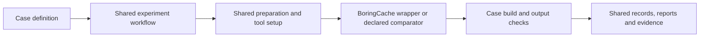

# BoringCache benchmarks

This repository contains workload definitions, technical evaluations, execution
tooling, and reporting contracts. The [product benchmark page](https://boringcache.com/benchmarks)
uses reviewed results. New evaluations do not automatically become published claims.

Workloads live in [`cases/`](cases/). Each case pins its upstream source and declares
its recipe, comparison, cache scope, and output verification. Exploratory technical
work is an **evaluation**. Promotion changes metadata and suite membership; it does
not change the case's identity or copy its executor.

Follow [`docs/process.md`](docs/process.md) to add or run a case.
[`AGENTS.md`](AGENTS.md) applies the same requirements to agents and humans.
`bin/bench catalog` generates [`data/latest/series.json`](data/latest/series.json),
the common index for planned, requested, incomplete, failed, and completed
evaluations. It uses the canonical report validator and calculations, retains
evidence gaps, and leaves publication review explicit.

Standard comparisons use two shared fresh and rolling workflows, which also
support `workflow_call`. All cases use one [BoringCache wrapper](.github/actions/boringcache/action.yml)
for the product invocation and release pin. Preparation and common tool setup
use shared actions; case payloads keep their upstream recipe and output checks.



```sh
bundle install
bin/bench list
bin/bench check
bin/bench plan hugo-go --lane fresh
bin/bench prepare hugo-go --native-lane fresh --directory /tmp/hugo-benchmark
bin/bench start hugo-go --series screening-01 --lane fresh --samples 2
```

All BoringCache plans use `boringcache/benchmarks`. Case tags and series identities
control reuse within that workspace. GitHub Actions uses OIDC; connection to the
existing workspace must be verified before cutover.

Compare the declared build and cache reuse operation. Record storage with its
provider and measurement source. Queue delay, unrelated dependency setup, and job
duration explain a run but do not establish a cache-performance claim. Keep cold,
identical-source warm, and changed-source results separate. Collect the declared
samples and report medians and ranges without discarding slow observations.

Published interfaces remain available:

- [`data/latest/report.md`](data/latest/report.md): latest published cohort report
- [`data/latest/index.json`](data/latest/index.json): machine-readable workload index
- [`data/latest/providers.json`](data/latest/providers.json): provider comparisons
- [`suites/published.json`](suites/published.json): shared publication registry
- [`results/historical-website/report.md`](results/historical-website/report.md): reviewed historical website observations and preserved evidence

Historical run URLs retain their original execution repository. A moved case does
not move an Actions run. Evidence preservation exports each attempt, jobs, logs,
artifacts, commit, and workflow, records checksums, and reports missing material.

Consolidation is in progress. [`docs/migration.md`](docs/migration.md) lists its
acceptance conditions. Old repositories remain until their execution, callers,
published references, and required evidence are verified. Forks are deferred in
[`migration/forks.json`](migration/forks.json), outside the active suite. Select
and migrate a fork evaluation when needed.
